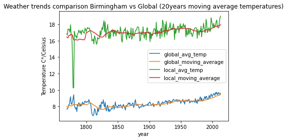

# Explore Weather Trend

### Summary

In this project, you will analyze local and global temperature data and compare the temperature trends where you live to overall global temperature trends.

### Instructions
Your goal will be to create a visualization and prepare a write up describing the similarities and differences between global temperature trends and temperature trends in the closest big city to where you live. To do this, you'll follow the steps below:

- `Extract the data` from the database. There's a workspace in the previous section that is connected to a database. You'll need to export the temperature data for the world as well as for the closest big city to where you live. You can find a list of cities and countries in the `city_list` table. To interact with the database, you'll need to write a SQL query.
  - Write a SQL query to extract the city level data. Export to CSV.
  - Write a SQL query to extract the global data. Export to CSV.
- `Open up the CSV` in whatever tool you feel most comfortable using. We suggest using Excel or Google sheets, but you are welcome to use another tool, such as Python or R.
- `Create a line chart` that compares your city's temperatures with the global temperatures. Make sure to plot the moving average rather than the yearly averages in order to smooth out the lines, making trends more observable (the last concept in the previous lesson goes over how to do this in a spreadsheet).
- `Make observations` about the similarities and differences between the world averages and your city's averages, as well as overall trends. Here are some questions to get you started.
  - Is your city hotter or cooler on average compared to the global average? Has the difference been consistent over time?
  - How do the changes in your city's temperatures over time compare to the changes in the global average?
  - What does the overall trend look like? Is the world getting hotter or cooler? Has the trend been consistent over the last few hundred years?

### Solutions

#### Outline
- The tools I'm using: 
  - I used `SQL` to extract the .csv data out.
  - I used `Python` to do the rest.
- steps:
  - I wrote some SQLs to extract the data out. One is the temperatures in my City (Birmingham, US) and another is the global temperatures. Saved as local.csv and global.csv.
  - I read those .csv files in Jupyter notebook by using `pd.read_csv()` function.
  - I cleaned the NaN value by using forward replacement by using `fillna()` method.
  - I also checked the duplications by using `drop_duplicates()`method .
  - I did the moving average calculation by using `rolling()` method.
  - I used the Matplotlib to plot the pictures.

#### Results
- Moving window = 5, the Trends are like  

- Moving window = 10, the Trends are like 

- Moving window = 20, the Trends are like 

  
  Some conclusions:
  - It looks like the temperature of Birminghan is always hotter than the global about 8 degrees.
  - They have similar shape of trends for the city Birmingham and the Global Average. They both have some big oscillation before 1850 and basically goes up after 1850.
  - In year 1779, Birmingham reached the lowest temperature 10.26 degree, which is shown in picture obviously. At the same year, the global temperature reached 8.98 degree. And their difference was only 1.28 degree.
  - With large window size, the trend looks smoother. For window_size = 10, it shows a better summary of how the trend goes than the one with window size = 5.

#### Accessory
- code attached here in [Jupyter notebook](Weather-Trends.ipynb).

