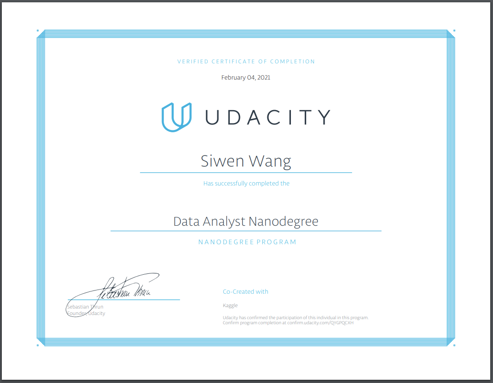

# Data-Analyst-Nanodegree-Project

### First project：

[Explore Weather Trend](Exploring-Weather-Trends.md)

### Second project:

[Investigate a Dataset](investigate-a-dataset.ipynb)

### Third project:

[Analyze A/B test results](Analyze_ab_test_results_notebook.ipynb)

### Fourth project:

[Gathering, wrangling and analyzing WeRateDogs Twitter data](wrangle_act.ipynb)

### Fifth project:

